## Часть 1. Установка и настройка Ansible

1. Устанавливаем пакетный менеджер pip для нашего python: ```curl https://bootstrap.pypa.io/get-pip.py -o get-pip.py && python3 get-pip.py```
   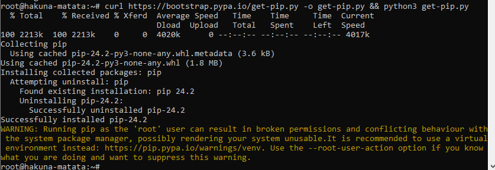
2. Устанавливаем, собственно, ansible: ```python3 -m pip install ansible```
   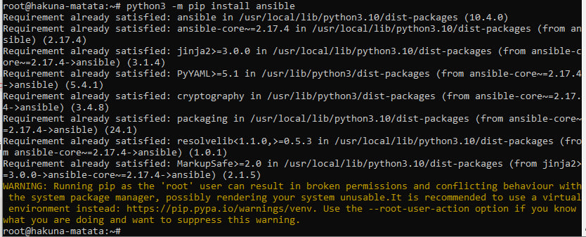
3. Выбираем или создаем директорию, где будем работать. Создаем базовый конфиг файл, затем папку ```inventory``` и в ней файл с хостами (тренироваться будем на localhost)
   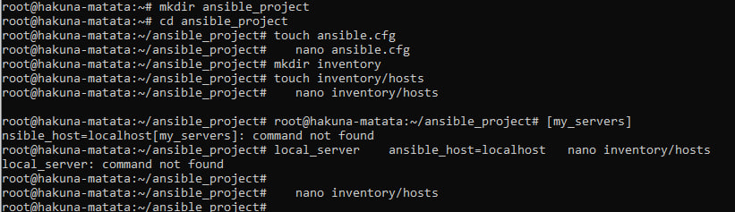
4. Проверяем, что сервер с Ansible подключился к “клиенту” (в нашем случае это одна и та же машина, localhost): ```ansible my_servers -m ping -c local``` и ```ansible my_servers -m setup -c local```
   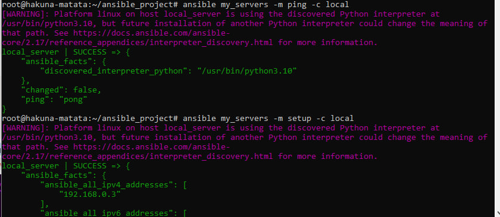
5. Пробуем выполнить команду посложнее на нашем клиенте
   - Создаем текстовый файл с производным содержимым, через модуль shell: ```ansible my_servers -c local -m shell -a 'echo test_file_content > $HOME/test.txt'```
   - Проверяем, что по нужному пути создался нужный файл с нужным именем и содержимым
   - Удаляем файл через модуль file: ```ansible my_servers -c local -m file -a 'path=$HOME/test.txt state=absent'```
     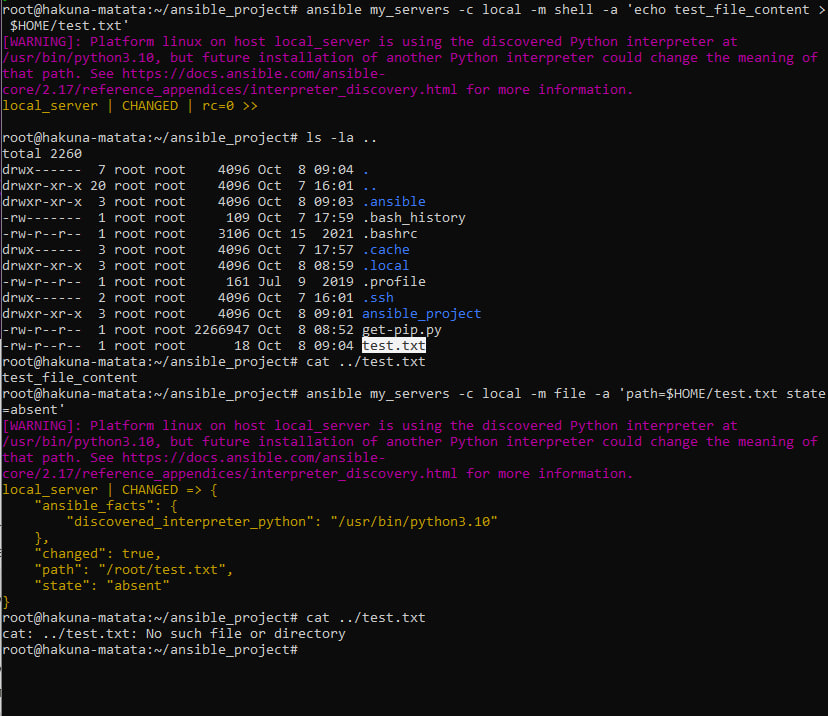
## Часть 2. Установка Caddy

1. В части 1 были рассмотрены базовые ad-hoc команды для Ansible, пора переходить к более сложным конструкциям - Ansible Playbooks. Устанавливать будем вебсервер Caddy. Для начала создадим в рабочей директории папку ```roles``` и в ней инициализируем исходное конфигурационное “дерево”: ```ansible-galaxy init caddy_deploy```
   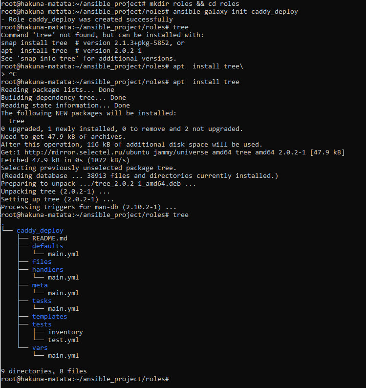
2. Наполняем файл ```roles/caddy_deploy/tasks/main.yml```. Здесь мы описываем непосредственно шаги, которые будут выполняться в нашем плейбуке (по сути, несколько команд ```ansible -m ******``` подряд)
   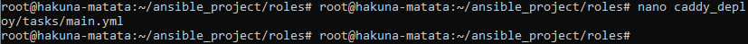
3. Наконец, в рабочей директории создаем собственно файл конфигурации самого плейбука, где указываем нужные нам хосты и роли

   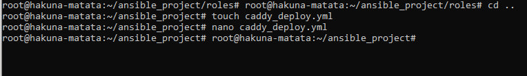
4. Запускаем плейбук: ```ansible-playbook caddy_deploy.yml``` и проверяем, успешно ли все шаги выполнились
   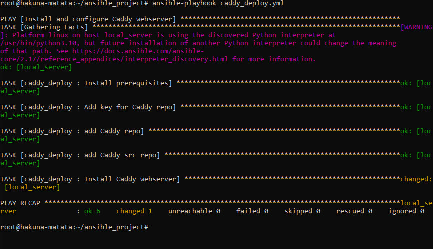
## Часть 3. Домен и настройка Caddyfile

1. Регистрируем себе бесплатный домен на выданный ранее ip-адрес, например на сервисе duckdns.org
   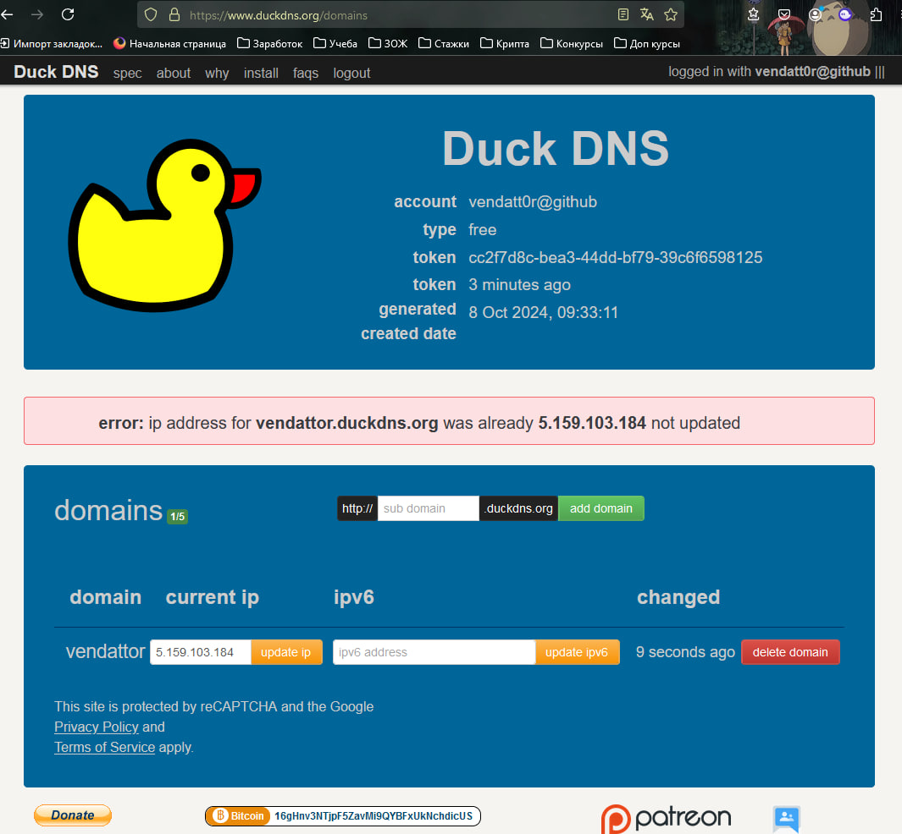
2. Попробуем использовать доп. возможности плейбуков - создадим шаблон (Jinja2) и переменные (в формате ```{{ var }}```)
   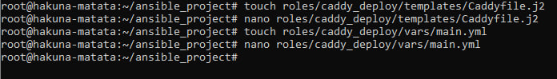
3. Добавляем в наш плейбук (в tasks) новые шаги, отвечающие за создание конфигурационного файла из шаблона и последующую перезагрузку сервиса:

   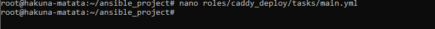
4. Снова запускаем плейбук, после чего вводим в браузере имя своего домена и убеждаемся, что тестовая страничка Caddy автоматически поднялась на подписанном сертификате с https
   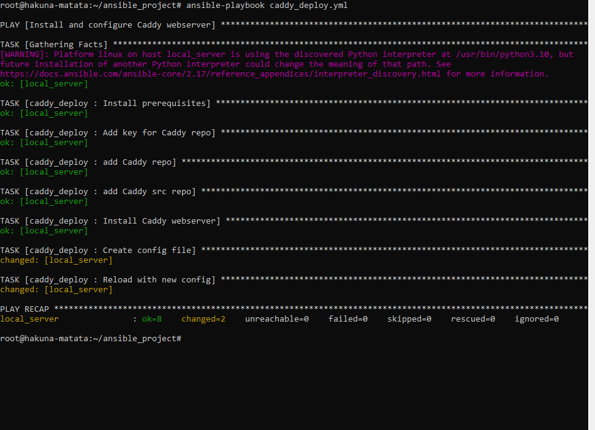
   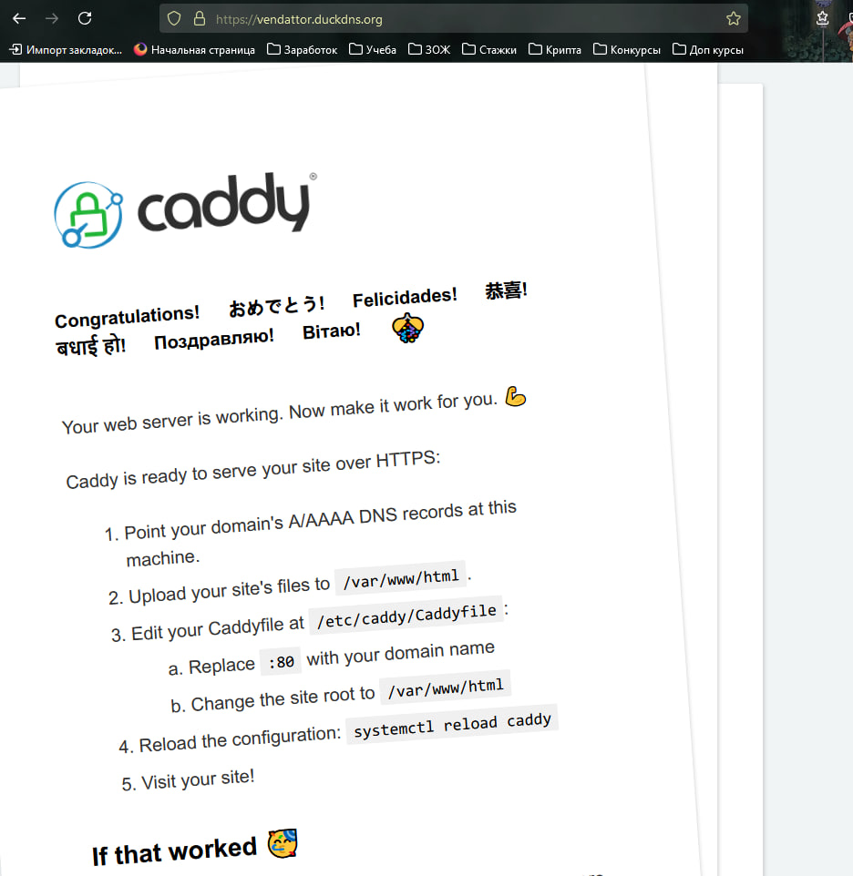
## Задание

1. Переписать пример с созданием и удалением файла из шага 5 Части 1 с ad-hoc команд на плейбук формат, а так же добавить четвертый шаг - перед удалением поменять содержимое файла на любое другое.
   - Create a text file with content: Создаем файл test.txt с содержимым "test_file_content".
   - Verify file creation: Проверяем, что файл был создан.
   - Ensure file exists: Убедимся, что файл существует, используя модуль assert.
   - Change file content: Заменяем содержимое файла на "new_file_content".
   - Delete the file: Удаляем файл с помощью модуля file.
   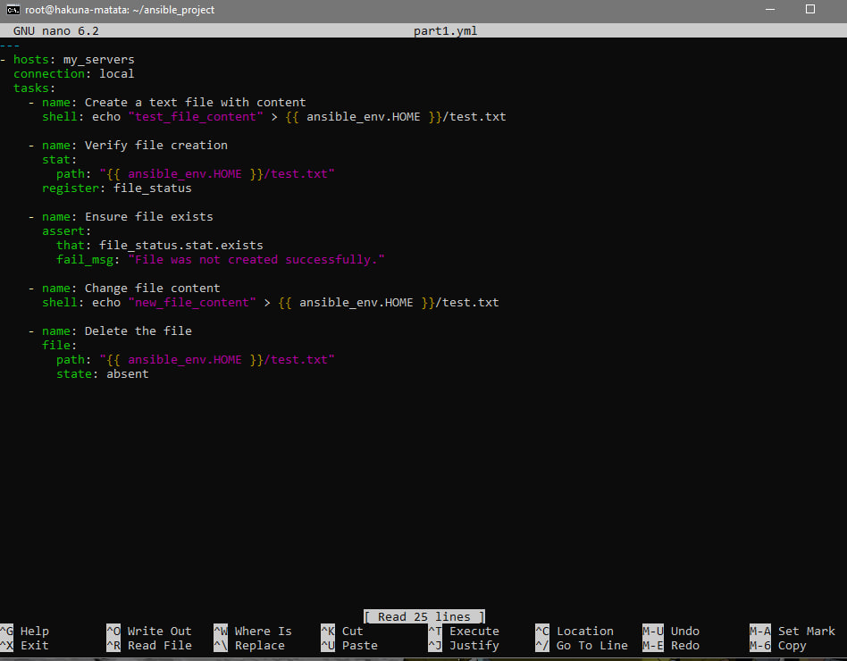
   Результат:
   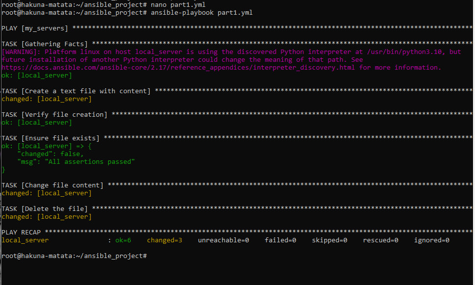
2. “Расширить” конфиг вебсервера Caddy любым функционалом по желанию: например, добавить проксирование, или какие-нибудь заголовки (header). Вместо дефолтной страницы Caddy подставить свою, хотя бы index.html с Hello world внутри. Добавить это в качестве дополнительного шага в tasks
   Подстановка index.html вместо дефолтной страницы (в tasks 'Copy custom index.html'):
   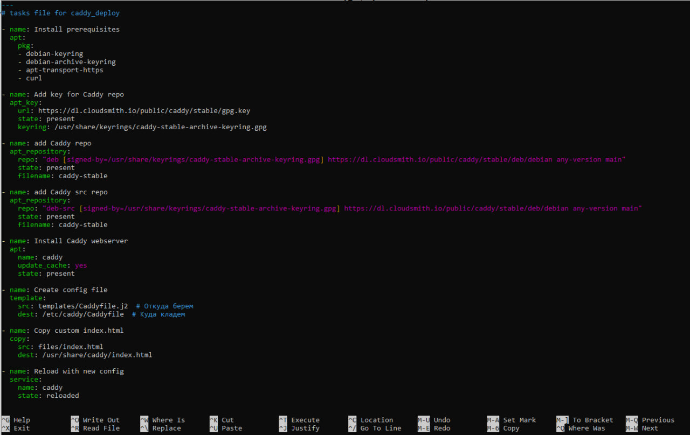
   Код index.html:  
   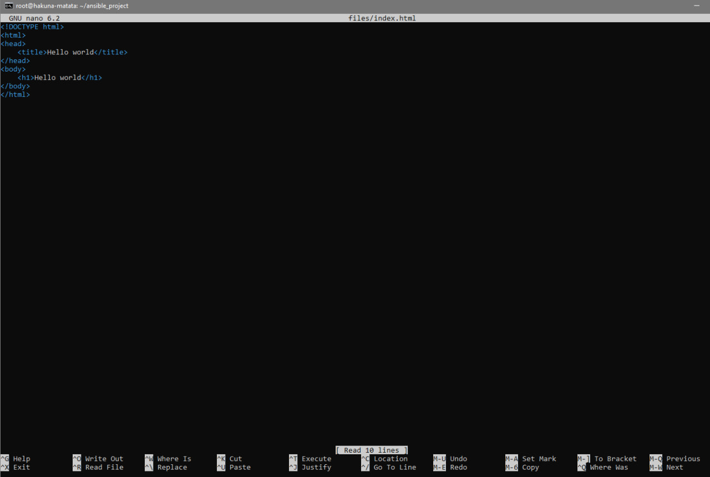
   Страница:
   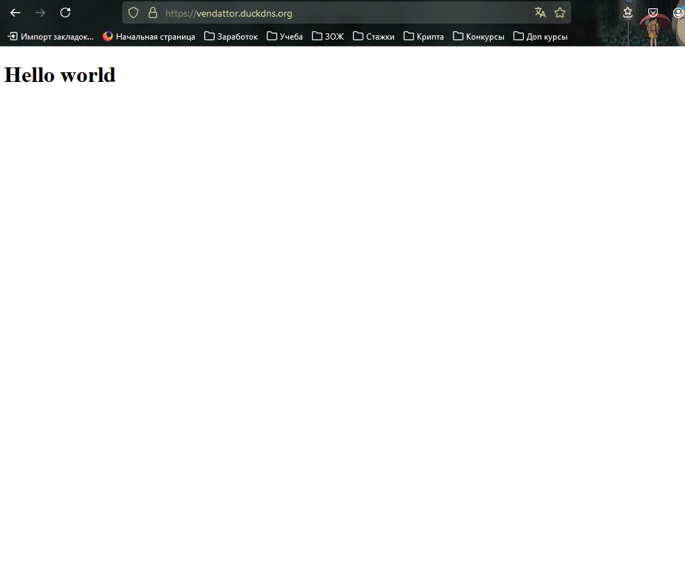
