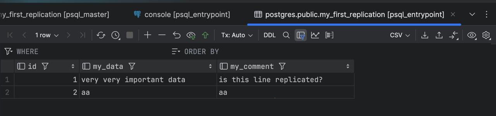

## Часть 1. Поднимаем Postgres

 1. Подготавливаем Dockerfile для нашего постгреса. Кластеризацию будем делать с помощью  Patroni, а ему необходим доступ к бинарникам  самого постгреса. Поэтому будем билдить образ, который сразу содержит в себе Postgres + Patroni
 
 2. Подготавливаем compose файл, в котором описываем наш деплой постгреса. Так же добавляем в него Zookepeer, который нужен для непосредственного управления репликацией и определением “лидераˮ кластера
 
 3. Создаем упомянутые выше postgres0.yml и затем на основе него —  postgres1.yml (надо будешь лишь поменять имя, адреса и место хранения данных ноды с первой на вторую)
 
 4. Деплоим. Проверяем в логах, что зукипер запустился, и что одна нода постгреса из двух стала лидером/овнером/мастером (есть вероятность, что вопреки названию это будет НЕ pg-master, это нормально!)
 
## Часть 2. Проверяем репликацию

 1. Берем ЛЮБОЙ постгрес клиент (голый psql, pgAdmin, DBeaver, …) и подключаемся к обеим нодам постгреса: dbname/username/password = postgres (либо свой вариант, если меняли в конфигах/композе), host/port = pg-master:5433 и pg-slave:5434. Мы взяли PyCharm с плагином PostgreSQL:
 
 
 2. Из двух подключений выбираем pg-master (только если, оно является Лидером этого кластера). Создаем таблицу с ЛЮБОЙ структурой и записываем в нее ЛЮБЫЕ данные
 
 

 3.  Заходим в подключение pg-slave и наблюдаем магию: во второй базе данных автоматически создалась такая же таблица с такими же данными

 

 4. В подключении pg-slave пробуем провести какую-нибудь операцию на редактирование. Например, попытаемся вставить новые данные в таблицу, или вовсе удалить ее. Получим отказ, т.к. эта нода работает в режиме slave/readonly
 
 
##  Часть 3. Делаем высокую доступность
 1. Для балансировки трафика нам нужен специальное ПО, собственно балансировщик. Например, HAProxy — добавляем его в docker-compose.yml :
 
 2. Не забываем создать упомянутый выше haproxy.cfg со следующим содержимым:
 
 3. Перезапускаем проект, проверяем что:
  - Обе ноды корректно поднялись и распределили между собой роли мастера и слейва (аналогично Пункту 4 Части 1)
  - Зукипер подцепился к кластеру без ошибок (аналогично Пункту 4 Части 1)
  - Хапрокси поднялась без ошибок
 
 4. Аналогично Пункту 1 Части 2, подключаемся к “новойˮ базе данных, в качестве адреса используя имя контейнера с HAProxy. Проверяем, что подключение успешное - по умолчанию оно всегда будет редиректить трафик на мастер-ноду
 
## Задание

Любым способом выключаем доступ до ноды, которая сейчас является мастером (например, через docker stop ). Некоторое время ждем, после этого анализируем логи и так же пытаемся считать/записать что-то в БД через entrypoint подключение. Затем необходимо расписать, получилось или нет, а так же объяснить, что в итоге произошло после принудительного выключения мастера (со скриншотами)

- Выключаем доступ до ноды, которая сейчас является мастером

- Анализируем логи: pg-slave является лидером


- Пытаемся записать что-то в БД через entrypoint подключение, все получилось, эта же строчка появляется в pg-slave


## Вопросы
  - Порты 8008 и 5432 вынесены в разные директивы, expose и ports. По сути, если записать 8008 в ports, то он тоже станет exposed. В 
чем разница?

```expose``` позволяет контейнерам, в нашей лабе pg-master и pg-slave, взаимодействовать друг с другом внутри Docker-сети без необходимости публикации портов наружу, а ```ports``` открывает доступ извне, то есть в нашей лабе для подключения к PostgreSQL.
 
  -  При обычном перезапуске композ-проекта, будет ли сбилден заново образ? А если предварительно отредактировать файлы 
postgresX.yml? А если содержимое самого Dockerfile? Почему?

   При обычном перезапуске композ-проекта образ не будет сбилден заново, потому что композ использует уже существующие образы, которые были ранее собраны. 
   
   Если же отредактировать файлы postgresX.yml, образ также не будет сбилден заново, потому что такие файлы обычно монтируются в контейнер как внешние тома и не вызывают пересборку образа, а изменения будут применены при следующем запуске контейнера. 
   
   Если же отредактировать содержимое самого Dockerfile, образ будет сбилден заново только при использовании флага build (```docker-compose up --build```), так как Docker не отслеживает такие изменения автоматически.
